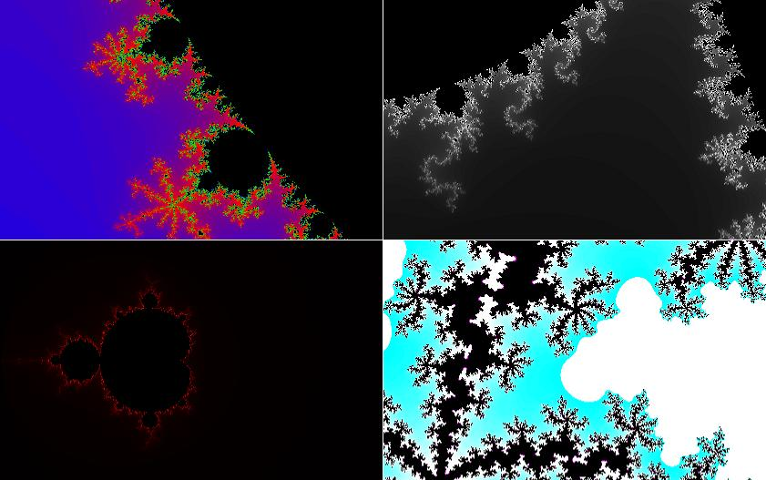



## Mandelbrot Set Screen Saver

### Description

Every time I look at the Mandelbrot Set I am amazed by it. So I decided to make an application to view it. I ended up making a screen saver out of it. It generates an image and then zooms in around the edges. The screen saver must be compiled to use due to the rules against uploading applications and dlls. Steps to compile are included (basically compiling an exe but with a .scr extension.
 
### More Info
 
Command Line Arguments:

/s - View Screen Saver

/p - Do nothing

[other] - View Configuration

Configuration:

Resolution

Accuracy

Colours

Graphical Images of the Mandelbrot Set.

Uses A lot of CPU but has been made to use unused CPU.

             |
---                |---
**Submitted On**   |2009-01-22 20:09:18
**By**             |[Ashley Newson](https://github.com/Planet-Source-Code/PSCIndex/blob/master/ByAuthor/ashley-newson.md)
**Level**          |Advanced
**User Rating**    |4.7 (14 globes from 3 users)
**Compatibility**  |VB 6\.0
**Category**       |[Graphics](https://github.com/Planet-Source-Code/PSCIndex/blob/master/ByCategory/graphics__1-46.md)
**World**          |[Visual Basic](https://github.com/Planet-Source-Code/PSCIndex/blob/master/ByWorld/visual-basic.md)
**Archive File**   |[Mandelbrot2141371232009\.zip](https://github.com/Planet-Source-Code/ashley-newson-mandelbrot-set-screen-saver__1-71629/archive/master.zip)

